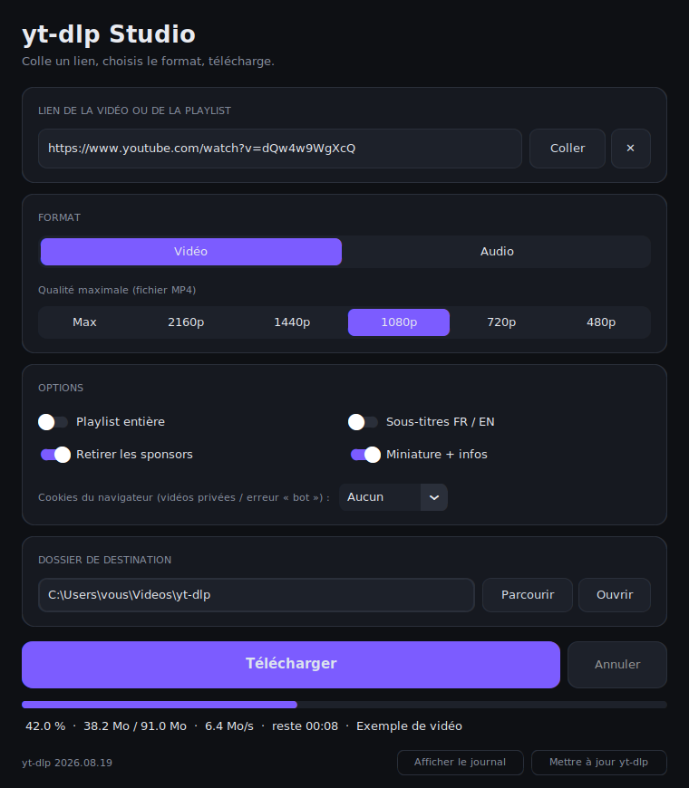

Vous voulez garder une vidéo YouTube pour la regarder hors ligne, extraire la bande-son d'un podcast ou archiver une playlist entière ? L'outil de référence pour ça s'appelle **[yt-dlp](https://github.com/yt-dlp/yt-dlp)**. Il est gratuit, open source, très actif… mais il s'utilise en ligne de commande, ce qui peut rebuter au premier abord.

Dans ce tutoriel, on va :

1. comprendre ce qu'est yt-dlp ;
2. l'installer proprement sous Windows avec Python ;
3. découvrir les commandes les plus utiles ;
4. régler les erreurs les plus courantes ;
5. et pour finir, **créer une interface graphique moderne** pour ne plus jamais taper une commande.



---

## 1. yt-dlp, c'est quoi ?

yt-dlp est un programme en ligne de commande qui **télécharge des vidéos et de l'audio depuis YouTube et plus d'un millier d'autres sites** : Vimeo, Dailymotion, Twitch, X/Twitter, TikTok, SoundCloud, de nombreux sites d'actualité, etc.

C'est un *fork* (une version dérivée) de l'ancien **youtube-dl**, devenu quasiment inactif. yt-dlp l'a largement remplacé : il est plus rapide, mis à jour très fréquemment pour suivre les changements de YouTube, et beaucoup plus riche en fonctionnalités.

Ce qu'il sait faire :

- télécharger **une vidéo, une playlist ou une chaîne entière** ;
- choisir la **qualité** (4K, 1080p, 720p…) ou ne garder que **l'audio** (MP3, M4A, Opus, FLAC…) ;
- récupérer **sous-titres, miniatures, chapitres et métadonnées** ;
- supprimer automatiquement les **passages sponsorisés** grâce à SponsorBlock ;
- **reprendre** un téléchargement interrompu ;
- utiliser les **cookies de votre navigateur** pour les contenus qui demandent une connexion.

> ⚖️ **Un mot sur la légalité** : l'outil en lui-même est légal, mais télécharger du contenu protégé par le droit d'auteur peut enfreindre les conditions d'utilisation des plateformes ou la loi selon l'usage que vous en faites. Réservez-le à vos propres contenus, aux œuvres libres de droits ou à un usage personnel conforme à la législation de votre pays.

---

## 2. Installation sous Windows (avec Python)

On va installer quatre éléments :

| Outil | Rôle |
|---|---|
| **Python** | fait tourner yt-dlp |
| **yt-dlp** | le téléchargeur lui-même |
| **ffmpeg** | assemble l'image et le son, convertit les formats (MP3, MP4…) |
| **Deno** | moteur JavaScript désormais nécessaire pour YouTube |

Tout se passe dans **PowerShell** : touche Windows → tapez `powershell` → Entrée.

### Étape 1 : Vérifier (ou installer) Python

```powershell
py --version
```

Si une version s'affiche (`Python 3.12` ou plus récent), c'est bon. Sinon :

```powershell
winget install Python.Python.3.13
```

Puis **fermez et rouvrez PowerShell**.

### Étape 2 : Installer yt-dlp

```powershell
py -m pip install -U "yt-dlp[default]"
```

L'option `[default]` ajoute les dépendances recommandées (dont `yt-dlp-ejs`, utile pour YouTube).

Vérifiez l'installation :

```powershell
yt-dlp --version
```

#### ⚠️ Problème fréquent : « yt-dlp n'est pas reconnu »

Pendant l'installation, pip affiche peut-être un avertissement de ce genre :

```
WARNING: The script yt-dlp.exe is installed in
'C:\Users\VOUS\AppData\Local\Python\pythoncore-3.14-64\Scripts' which is not on PATH.
```

Cela signifie que Windows ne sait pas où trouver le programme. Deux solutions :

**Solution rapide** : passer par Python. Attention, le module s'écrit avec un **tiret bas** :

```powershell
py -m yt_dlp --version
```

(`py -m yt-dlp` avec un tiret ne fonctionne pas.)

**Solution durable** : ajouter le dossier indiqué dans l'avertissement à votre PATH. Remplacez le chemin par celui affiché chez vous :

```powershell
$scripts = "C:\Users\VOUS\AppData\Local\Python\pythoncore-3.14-64\Scripts"
[Environment]::SetEnvironmentVariable("Path", [Environment]::GetEnvironmentVariable("Path","User") + ";$scripts", "User")
```

Fermez PowerShell, rouvrez-le : `yt-dlp --version` doit maintenant répondre.

### Étape 3 : Installer ffmpeg

YouTube envoie la vidéo et le son **séparément**. ffmpeg les réassemble et gère toutes les conversions.

```powershell
winget install Gyan.FFmpeg
```

Rouvrez PowerShell puis vérifiez :

```powershell
ffmpeg -version
```

> Si ffmpeg reste introuvable après avoir rouvert le terminal, ajoutez le dossier des raccourcis winget au PATH :
>
> ```powershell
> $links = "$env:LOCALAPPDATA\Microsoft\WinGet\Links"
> [Environment]::SetEnvironmentVariable("Path", [Environment]::GetEnvironmentVariable("Path","User") + ";$links", "User")
> ```

### Étape 4 : Installer Deno

Depuis fin 2025, yt-dlp a besoin d'un moteur JavaScript externe pour déchiffrer certains formats YouTube. Sans lui, vous risquez des erreurs ou des qualités manquantes.

```powershell
winget install DenoLand.Deno
```

Le message *« restart your shell to use the new value »* signifie simplement : **rouvrez PowerShell**. Puis :

```powershell
deno --version
```

✅ Si `yt-dlp --version`, `ffmpeg -version` et `deno --version` répondent tous les trois, l'installation est terminée.

---

## 3. Les commandes essentielles

Placez-vous d'abord dans un dossier adapté (évitez `C:\WINDOWS\System32`, où PowerShell s'ouvre parfois par défaut) :

```powershell
cd $HOME\Videos
```

> 💡 Mettez toujours l'URL **entre guillemets** : les caractères `&` présents dans certaines adresses perturbent PowerShell.

### Télécharger une vidéo dans la meilleure qualité

```powershell
yt-dlp "https://www.youtube.com/watch?v=XXXX"
```

Vous verrez défiler `[youtube]` (analyse), deux `[download] 100%` (image, puis son) et enfin `[Merger]` : c'est ffmpeg qui assemble le tout.

### En MP4 1080p, lisible partout

```powershell
yt-dlp -f "bv*[height<=1080]+ba" --merge-output-format mp4 "URL"
```

### Uniquement l'audio en MP3

```powershell
yt-dlp -x --audio-format mp3 "URL"
```

### Une playlist complète, numérotée, dans son propre dossier

```powershell
yt-dlp -o "%(playlist)s/%(playlist_index)03d - %(title)s.%(ext)s" "URL_PLAYLIST"
```

### Voir toutes les qualités disponibles

```powershell
yt-dlp -F "URL"
```

### Sous-titres français intégrés à la vidéo

```powershell
yt-dlp --write-subs --sub-langs "fr.*" --embed-subs "URL"
```

### Supprimer les passages sponsorisés

```powershell
yt-dlp --sponsorblock-remove sponsor "URL"
```

---

## 4. Un fichier de configuration pour vos réglages par défaut

Plutôt que de retaper les mêmes options, créez un fichier de configuration :

```powershell
mkdir "$env:APPDATA\yt-dlp" -Force
notepad "$env:APPDATA\yt-dlp\config.txt"
```

Collez-y par exemple :

```
-f bv*[height<=1080]+ba/b
--merge-output-format mp4
-o %USERPROFILE%\Videos\yt-dlp\%(title)s.%(ext)s
--embed-thumbnail
--embed-metadata
--sponsorblock-remove sponsor
```

Désormais, un simple `yt-dlp "URL"` télécharge en 1080p MP4, avec miniature et métadonnées, sans les sponsors, directement dans `Vidéos\yt-dlp`.

---

## 5. Mettre à jour et dépanner

YouTube modifie régulièrement son fonctionnement. **Quand un téléchargement échoue, le premier réflexe est de mettre à jour** :

```powershell
py -m pip install -U "yt-dlp[default]"
```

| Message d'erreur | Solution |
|---|---|
| `yt-dlp n'est pas reconnu…` | Utiliser `py -m yt_dlp` ou ajouter le dossier Scripts au PATH (étape 2) |
| `No module named yt-dlp` | Écrire `yt_dlp` avec un tiret bas |
| `ffmpeg not found` | Rouvrir PowerShell après l'installation de ffmpeg |
| `Sign in to confirm you're not a bot` | Ajouter `--cookies-from-browser firefox` (le navigateur où vous êtes connecté à YouTube) |
| Erreur 403, formats manquants | Mettre à jour yt-dlp et vérifier que Deno est installé |

---

## 6. Bonus : yt-dlp Studio, une interface graphique en Python "maison"

La ligne de commande, c'est puissant… mais pas toujours pratique au quotidien. Voici donc **yt-dlp Studio**, une petite application que j'ai codé qui regroupe toutes les options vues plus haut sous forme de boutons.

### Fonctionnalités

- un champ pour **coller l'URL** (bouton *Coller*, plusieurs liens acceptés, touche Entrée pour lancer) ;
- un choix **Vidéo / Audio** :
  - vidéo en MP4 : Max, 2160p, 1440p, 1080p, 720p, 480p ;
  - audio : MP3, M4A, Opus, FLAC, WAV ;
- des interrupteurs : **playlist entière**, **sous-titres FR/EN**, **suppression des sponsors**, **miniature + métadonnées** ;
- un menu **cookies du navigateur** pour les vidéos privées ou l'erreur « bot » ;
- le choix du **dossier de destination** (boutons *Parcourir* / *Ouvrir*) ;
- une **barre de progression** avec vitesse, temps restant et titre, plus un bouton **Annuler** ;
- un **journal** qui affiche la commande yt-dlp équivalente à vos choix, idéal pour apprendre ;
- un bouton **Mettre à jour yt-dlp** ;
- la **mémorisation** de vos derniers réglages.

L'application n'appelle pas `yt-dlp.exe` : elle utilise directement **yt-dlp comme bibliothèque Python**. Elle traduit vos choix en arguments de ligne de commande (les mêmes que dans ce tutoriel) puis les convertit en options grâce à `yt_dlp.parse_options()`. Les téléchargements tournent dans un thread séparé pour que l'interface reste fluide.

### Installation

Il faut une seule bibliothèque en plus, **CustomTkinter**, pour le design moderne :

```powershell
py -m pip install -U customtkinter
```

Enregistrez le code ci-dessous dans un fichier `yt_dlp_studio.py`, puis lancez-le :

```powershell
py yt_dlp_studio.py
```

> 💡 **Astuce** : renommez le fichier en `yt_dlp_studio.pyw` pour le lancer d'un double-clic, sans fenêtre de console en arrière-plan.

### Le code complet

```python
"""
Codé par :      simonlimitless / https://simonlimitless.github.io/
yt-dlp Studio : interface graphique pour yt-dlp

Prérequis :     winget install Python.Python.3.13
                winget install DenoLand.Deno
                winget install Gyan.FFmpeg
                py -m pip install -U customtkinter "yt-dlp[default]"

Lancement :     py yt_dlp_studio.py   (ou renommer en .pyw pour masquer la console)
"""

import json
import os
import queue
import subprocess
import sys
import threading
from pathlib import Path

# pythonw n'a pas de console : on évite les plantages si quelque chose écrit dans stdout
if sys.stdout is None:
    sys.stdout = open(os.devnull, "w", encoding="utf-8")
if sys.stderr is None:
    sys.stderr = open(os.devnull, "w", encoding="utf-8")

try:
    import customtkinter as ctk
    import yt_dlp
    from yt_dlp.utils import DownloadCancelled
except ImportError as e:
    import tkinter as tk
    from tkinter import messagebox
    root = tk.Tk(); root.withdraw()
    messagebox.showerror(
        "Module manquant",
        f"{e}\n\nOuvre PowerShell et lance :\n"
        'py -m pip install -U customtkinter "yt-dlp[default]"',
    )
    sys.exit(1)


# ─────────────────────────── Thème ───────────────────────────
BG = "#0e1014"
CARD = "#161920"
CARD_2 = "#1d212a"
BORDER = "#2a2f3a"
TEXT = "#e8eaf0"
MUTED = "#8a91a2"
ACCENT = "#7c5cff"
ACCENT_HOVER = "#6846f0"
SUCCESS = "#3ecf8e"
DANGER = "#ff5c6c"
WARN = "#f5b84b"

FONT = "Segoe UI"

VIDEO_QUALITIES = ["Max", "2160p", "1440p", "1080p", "720p", "480p"]
AUDIO_FORMATS = ["MP3", "M4A", "Opus", "FLAC", "WAV"]
BROWSERS = ["Aucun", "Firefox", "Edge", "Chrome", "Brave"]

SETTINGS_FILE = Path(os.getenv("APPDATA", Path.home())) / "yt-dlp-studio" / "settings.json"
DEFAULTS = {
    "folder": str(Path.home() / "Videos" / "yt-dlp"),
    "mode": "Vidéo",
    "video_quality": "1080p",
    "audio_format": "MP3",
    "playlist": False,
    "subs": False,
    "sponsor": True,
    "meta": True,
    "browser": "Aucun",
}


def load_settings():
    try:
        return {**DEFAULTS, **json.loads(SETTINGS_FILE.read_text(encoding="utf-8"))}
    except Exception:
        return dict(DEFAULTS)


def save_settings(data):
    try:
        SETTINGS_FILE.parent.mkdir(parents=True, exist_ok=True)
        SETTINGS_FILE.write_text(json.dumps(data, indent=2, ensure_ascii=False), encoding="utf-8")
    except Exception:
        pass


def fmt_bytes(n):
    if not n:
        return "?"
    for unit in ("o", "Ko", "Mo", "Go"):
        if n < 1024:
            return f"{n:.1f} {unit}"
        n /= 1024
    return f"{n:.1f} To"


def fmt_eta(s):
    if s is None:
        return "--:--"
    s = int(s)
    return f"{s // 60:02d}:{s % 60:02d}" if s < 3600 else f"{s // 3600}h{(s % 3600) // 60:02d}"


# ─────────────────────────── Logger yt-dlp → file d'attente ───────────────────────────
class QueueLogger:
    def __init__(self, q):
        self.q = q

    def debug(self, msg):
        if msg.startswith("[debug]"):
            return
        self.q.put(("log", msg, "info"))

    def info(self, msg):
        self.q.put(("log", msg, "info"))

    def warning(self, msg):
        self.q.put(("log", msg, "warn"))

    def error(self, msg):
        self.q.put(("log", msg, "error"))


# ─────────────────────────── Application ───────────────────────────
class App(ctk.CTk):
    def __init__(self):
        super().__init__()
        ctk.set_appearance_mode("dark")

        self.s = load_settings()
        self.q = queue.Queue()
        self.cancel_flag = threading.Event()
        self.worker = None

        self.title("yt-dlp Studio")
        self.geometry("760x870")
        self.minsize(680, 850)
        self.configure(fg_color=BG)

        self.f_title = ctk.CTkFont(FONT, 26, "bold")
        self.f_h = ctk.CTkFont(FONT, 13, "bold")
        self.f_body = ctk.CTkFont(FONT, 13)
        self.f_small = ctk.CTkFont(FONT, 11)
        self.f_btn = ctk.CTkFont(FONT, 15, "bold")
        self.f_mono = ctk.CTkFont("Consolas", 11)

        self.grid_columnconfigure(0, weight=1)
        self.grid_rowconfigure(6, weight=1)

        self._build_header()
        self._build_url_card()
        self._build_format_card()
        self._build_options_card()
        self._build_dest_card()
        self._build_action_area()
        self._build_log()
        self._build_footer()

        self._on_mode_change(self.s["mode"])
        self.bind("<Return>", lambda e: self.start_download())
        self.protocol("WM_DELETE_WINDOW", self._on_close)
        self.after(100, self._poll_queue)
        self.url_entry.focus()

    # ---------- helpers UI ----------
    def _card(self, row, title):
        card = ctk.CTkFrame(self, fg_color=CARD, corner_radius=14, border_width=1, border_color=BORDER)
        card.grid(row=row, column=0, sticky="ew", padx=24, pady=(0, 12))
        card.grid_columnconfigure(0, weight=1)
        ctk.CTkLabel(card, text=title.upper(), font=self.f_small, text_color=MUTED).grid(
            row=0, column=0, sticky="w", padx=18, pady=(12, 6))
        return card

    def _segmented(self, parent, values, command=None):
        return ctk.CTkSegmentedButton(
            parent, values=values, command=command, font=self.f_body, height=36,
            fg_color=CARD_2, unselected_color=CARD_2, unselected_hover_color=BORDER,
            selected_color=ACCENT, selected_hover_color=ACCENT_HOVER, text_color=TEXT,
            corner_radius=10,
        )

    def _switch(self, parent, text, value):
        var = ctk.BooleanVar(value=value)
        sw = ctk.CTkSwitch(parent, text=text, variable=var, font=self.f_body, text_color=TEXT,
                           progress_color=ACCENT, button_color="#ffffff", button_hover_color="#dddddd",
                           fg_color=BORDER)
        return sw, var

    # ---------- sections ----------
    def _build_header(self):
        head = ctk.CTkFrame(self, fg_color="transparent")
        head.grid(row=0, column=0, sticky="ew", padx=24, pady=(22, 14))
        ctk.CTkLabel(head, text="yt-dlp Studio", font=self.f_title, text_color=TEXT).pack(anchor="w")
        ctk.CTkLabel(head, text="Colle un lien, choisis le format, télécharge.",
                     font=self.f_body, text_color=MUTED).pack(anchor="w")

    def _build_url_card(self):
        card = self._card(1, "Lien de la vidéo ou de la playlist")
        row = ctk.CTkFrame(card, fg_color="transparent")
        row.grid(row=1, column=0, sticky="ew", padx=18, pady=(0, 16))
        row.grid_columnconfigure(0, weight=1)

        self.url_entry = ctk.CTkEntry(
            row, placeholder_text="https://www.youtube.com/watch?v=…  (plusieurs liens séparés par un espace)",
            height=44, font=self.f_body, fg_color=CARD_2, border_color=BORDER, border_width=1,
            text_color=TEXT, corner_radius=10)
        self.url_entry.grid(row=0, column=0, sticky="ew", padx=(0, 8))

        ctk.CTkButton(row, text="Coller", width=84, height=44, font=self.f_body, corner_radius=10,
                      fg_color=CARD_2, hover_color=BORDER, border_width=1, border_color=BORDER,
                      command=self._paste).grid(row=0, column=1, padx=(0, 6))
        ctk.CTkButton(row, text="✕", width=44, height=44, font=self.f_body, corner_radius=10,
                      fg_color=CARD_2, hover_color=BORDER, border_width=1, border_color=BORDER,
                      command=lambda: self.url_entry.delete(0, "end")).grid(row=0, column=2)

    def _build_format_card(self):
        card = self._card(2, "Format")
        self.mode_seg = self._segmented(card, ["Vidéo", "Audio"], self._on_mode_change)
        self.mode_seg.grid(row=1, column=0, sticky="ew", padx=18, pady=(0, 10))
        self.mode_seg.set(self.s["mode"])

        self.quality_label = ctk.CTkLabel(card, text="", font=self.f_small, text_color=MUTED)
        self.quality_label.grid(row=2, column=0, sticky="w", padx=18)

        self.video_seg = self._segmented(card, VIDEO_QUALITIES)
        self.video_seg.set(self.s["video_quality"])
        self.audio_seg = self._segmented(card, AUDIO_FORMATS)
        self.audio_seg.set(self.s["audio_format"])
        self._format_card = card

    def _build_options_card(self):
        card = self._card(3, "Options")
        grid = ctk.CTkFrame(card, fg_color="transparent")
        grid.grid(row=1, column=0, sticky="ew", padx=18, pady=(0, 14))
        grid.grid_columnconfigure((0, 1), weight=1)

        sw, self.v_playlist = self._switch(grid, "Playlist entière", self.s["playlist"])
        sw.grid(row=0, column=0, sticky="w", pady=6)
        sw, self.v_subs = self._switch(grid, "Sous-titres FR / EN", self.s["subs"])
        sw.grid(row=0, column=1, sticky="w", pady=6)
        self.sw_subs = sw
        sw, self.v_sponsor = self._switch(grid, "Retirer les sponsors", self.s["sponsor"])
        sw.grid(row=1, column=0, sticky="w", pady=6)
        sw, self.v_meta = self._switch(grid, "Miniature + infos", self.s["meta"])
        sw.grid(row=1, column=1, sticky="w", pady=6)

        crow = ctk.CTkFrame(card, fg_color="transparent")
        crow.grid(row=2, column=0, sticky="ew", padx=18, pady=(0, 16))
        ctk.CTkLabel(crow, text="Cookies du navigateur (vidéos privées / erreur « bot ») :",
                     font=self.f_small, text_color=MUTED).pack(side="left")
        self.browser_menu = ctk.CTkOptionMenu(
            crow, values=BROWSERS, width=120, height=30, font=self.f_body, corner_radius=8,
            fg_color=CARD_2, button_color=BORDER, button_hover_color=ACCENT,
            dropdown_fg_color=CARD_2, dropdown_hover_color=BORDER, text_color=TEXT)
        self.browser_menu.set(self.s["browser"])
        self.browser_menu.pack(side="left", padx=10)

    def _build_dest_card(self):
        card = self._card(4, "Dossier de destination")
        row = ctk.CTkFrame(card, fg_color="transparent")
        row.grid(row=1, column=0, sticky="ew", padx=18, pady=(0, 16))
        row.grid_columnconfigure(0, weight=1)

        self.folder_var = ctk.StringVar(value=self.s["folder"])
        ctk.CTkEntry(row, textvariable=self.folder_var, height=38, font=self.f_body, fg_color=CARD_2,
                     border_color=BORDER, text_color=TEXT, corner_radius=10).grid(
            row=0, column=0, sticky="ew", padx=(0, 8))
        ctk.CTkButton(row, text="Parcourir", width=100, height=38, font=self.f_body, corner_radius=10,
                      fg_color=CARD_2, hover_color=BORDER, border_width=1, border_color=BORDER,
                      command=self._browse).grid(row=0, column=1, padx=(0, 6))
        ctk.CTkButton(row, text="Ouvrir", width=80, height=38, font=self.f_body, corner_radius=10,
                      fg_color=CARD_2, hover_color=BORDER, border_width=1, border_color=BORDER,
                      command=self._open_folder).grid(row=0, column=2)

    def _build_action_area(self):
        box = ctk.CTkFrame(self, fg_color="transparent")
        box.grid(row=5, column=0, sticky="ew", padx=24, pady=(4, 10))
        box.grid_columnconfigure(0, weight=1)

        self.dl_btn = ctk.CTkButton(box, text="Télécharger", height=52, font=self.f_btn, corner_radius=12,
                                    fg_color=ACCENT, hover_color=ACCENT_HOVER, command=self.start_download)
        self.dl_btn.grid(row=0, column=0, sticky="ew", padx=(0, 8))
        self.cancel_btn = ctk.CTkButton(box, text="Annuler", width=110, height=52, font=self.f_body,
                                        corner_radius=12, fg_color=CARD_2, hover_color="#3a2027",
                                        border_width=1, border_color=BORDER, text_color=MUTED,
                                        state="disabled", command=self.cancel_download)
        self.cancel_btn.grid(row=0, column=1)

        self.progress = ctk.CTkProgressBar(box, height=8, corner_radius=4, fg_color=CARD_2,
                                           progress_color=ACCENT)
        self.progress.grid(row=1, column=0, columnspan=2, sticky="ew", pady=(14, 6))
        self.progress.set(0)

        self.status = ctk.CTkLabel(box, text="Prêt.", font=self.f_body, text_color=MUTED, anchor="w")
        self.status.grid(row=2, column=0, columnspan=2, sticky="ew")

    def _build_log(self):
        self.log = ctk.CTkTextbox(self, font=self.f_mono, fg_color=CARD, text_color=MUTED,
                                  border_width=1, border_color=BORDER, corner_radius=12, wrap="word")
        self.log_visible = False
        self.log.tag_config("warn", foreground=WARN)
        self.log.tag_config("error", foreground=DANGER)
        self.log.tag_config("ok", foreground=SUCCESS)
        self.log.tag_config("cmd", foreground=ACCENT)
        self.log.configure(state="disabled")

    def _build_footer(self):
        foot = ctk.CTkFrame(self, fg_color="transparent")
        foot.grid(row=7, column=0, sticky="ew", padx=24, pady=(0, 14))
        self.version_label = ctk.CTkLabel(foot, text=f"yt-dlp {yt_dlp.version.__version__}",
                                          font=self.f_small, text_color=MUTED)
        self.version_label.pack(side="left")
        self.update_btn = ctk.CTkButton(foot, text="Mettre à jour yt-dlp", width=150, height=28,
                                        font=self.f_small, corner_radius=8, fg_color="transparent",
                                        hover_color=CARD_2, border_width=1, border_color=BORDER,
                                        text_color=MUTED, command=self._update_ytdlp)
        self.update_btn.pack(side="right")
        self.log_btn = ctk.CTkButton(foot, text="Afficher le journal", width=140, height=28,
                                     font=self.f_small, corner_radius=8, fg_color="transparent",
                                     hover_color=CARD_2, border_width=1, border_color=BORDER,
                                     text_color=MUTED, command=self.toggle_log)
        self.log_btn.pack(side="right", padx=(0, 8))

    def toggle_log(self, show=None):
        show = (not self.log_visible) if show is None else show
        if show == self.log_visible:
            return
        self.log_visible = show
        w, h = self.winfo_width(), self.winfo_height()
        if show:
            self.log.grid(row=6, column=0, sticky="nsew", padx=24, pady=(0, 8))
            self.log_btn.configure(text="Masquer le journal")
            self.geometry(f"{w}x{h + 220}")
        else:
            self.log.grid_forget()
            self.log_btn.configure(text="Afficher le journal")
            self.geometry(f"{w}x{max(h - 220, 850)}")

    # ---------- actions UI ----------
    def _on_mode_change(self, mode):
        if mode == "Vidéo":
            self.audio_seg.grid_forget()
            self.video_seg.grid(row=3, column=0, sticky="ew", padx=18, pady=(4, 16))
            self.quality_label.configure(text="Qualité maximale (fichier MP4)")
            self.sw_subs.configure(state="normal")
        else:
            self.video_seg.grid_forget()
            self.audio_seg.grid(row=3, column=0, sticky="ew", padx=18, pady=(4, 16))
            self.quality_label.configure(text="Format audio (meilleure qualité disponible)")
            self.sw_subs.configure(state="disabled")

    def _paste(self):
        try:
            text = self.clipboard_get().strip()
        except Exception:
            return
        self.url_entry.delete(0, "end")
        self.url_entry.insert(0, text)

    def _browse(self):
        from tkinter import filedialog
        d = filedialog.askdirectory(initialdir=self.folder_var.get() or str(Path.home()))
        if d:
            self.folder_var.set(os.path.normpath(d))

    def _open_folder(self):
        folder = self.folder_var.get()
        os.makedirs(folder, exist_ok=True)
        if sys.platform == "win32":
            os.startfile(folder)
        else:
            subprocess.Popen(["xdg-open", folder])

    def _write_log(self, msg, tag="info"):
        self.log.configure(state="normal")
        self.log.insert("end", msg + "\n", tag)
        self.log.see("end")
        self.log.configure(state="disabled")

    def _current_settings(self):
        return {
            "folder": self.folder_var.get(),
            "mode": self.mode_seg.get(),
            "video_quality": self.video_seg.get(),
            "audio_format": self.audio_seg.get(),
            "playlist": self.v_playlist.get(),
            "subs": self.v_subs.get(),
            "sponsor": self.v_sponsor.get(),
            "meta": self.v_meta.get(),
            "browser": self.browser_menu.get(),
        }

    # ---------- construction de la commande ----------
    def build_args(self, s):
        """Construit les arguments comme en ligne de commande (affichés dans le journal)."""
        folder = s["folder"]
        args = []

        if s["playlist"]:
            tpl = os.path.join(folder, "%(playlist_title)s", "%(playlist_index)03d - %(title)s.%(ext)s")
            args += ["--yes-playlist", "-o", tpl]
        else:
            args += ["--no-playlist", "-o", os.path.join(folder, "%(title)s.%(ext)s")]

        if s["mode"] == "Vidéo":
            q = s["video_quality"]
            args += ["-f", "bv*+ba/b", "--merge-output-format", "mp4"]
            if q != "Max":
                h = int(q.rstrip("p"))
                sort = f"res:{h},vcodec:h264,acodec:m4a" if h <= 1080 else f"res:{h}"
                args += ["-S", sort]
            if s["subs"]:
                args += ["--write-subs", "--sub-langs", "fr.*,en.*", "--embed-subs"]
        else:
            args += ["-x", "--audio-format", s["audio_format"].lower(), "--audio-quality", "0"]

        if s["sponsor"]:
            args += ["--sponsorblock-remove", "sponsor"]
        if s["meta"]:
            args += ["--embed-metadata", "--embed-thumbnail", "--convert-thumbnails", "jpg"]
        if s["browser"] != "Aucun":
            args += ["--cookies-from-browser", s["browser"].lower()]
        return args

    # ---------- téléchargement ----------
    def start_download(self):
        if self.worker and self.worker.is_alive():
            return
        urls = self.url_entry.get().split()
        if not urls:
            self.status.configure(text="Colle d'abord un lien.", text_color=WARN)
            return

        s = self._current_settings()
        save_settings(s)
        os.makedirs(s["folder"], exist_ok=True)
        args = self.build_args(s)

        shown = " ".join(f'"{a}"' if (" " in a or "%" in a or "*" in a) else a for a in args)
        self._write_log(f"\n$ yt-dlp {shown} " + " ".join(f'"{u}"' for u in urls), "cmd")

        self.cancel_flag.clear()
        self.progress.set(0)
        self.dl_btn.configure(state="disabled", text="Téléchargement…")
        self.cancel_btn.configure(state="normal", text_color=DANGER)
        self.status.configure(text="Analyse du lien…", text_color=MUTED)

        self.worker = threading.Thread(target=self._run, args=(args, urls), daemon=True)
        self.worker.start()

    def cancel_download(self):
        self.cancel_flag.set()
        self.status.configure(text="Annulation…", text_color=WARN)

    def _run(self, args, urls):
        try:
            opts = yt_dlp.parse_options(args + urls).ydl_opts
            opts.update({
                "logger": QueueLogger(self.q),
                "progress_hooks": [self._hook],
                "postprocessor_hooks": [self._pp_hook],
                "noprogress": True,
                "quiet": False,
            })
            with yt_dlp.YoutubeDL(opts) as ydl:
                code = ydl.download(urls)
            self.q.put(("done", code == 0, None))
        except DownloadCancelled:
            self.q.put(("cancelled", None, None))
        except Exception as e:
            if self.cancel_flag.is_set():
                self.q.put(("cancelled", None, None))
            else:
                self.q.put(("log", f"ERREUR : {e}", "error"))
                self.q.put(("done", False, None))

    def _hook(self, d):
        if self.cancel_flag.is_set():
            raise DownloadCancelled()
        info = d.get("info_dict", {})
        title = info.get("title", "")
        idx, total_items = info.get("playlist_index"), info.get("n_entries")
        prefix = f"[{idx}/{total_items}] " if idx and total_items else ""

        if d["status"] == "downloading":
            done = d.get("downloaded_bytes") or 0
            total = d.get("total_bytes") or d.get("total_bytes_estimate")
            frac = done / total if total else 0
            speed = d.get("speed")
            txt = (f"{prefix}{frac * 100:5.1f} %  ·  {fmt_bytes(done)} / {fmt_bytes(total)}  ·  "
                   f"{fmt_bytes(speed)}/s  ·  reste {fmt_eta(d.get('eta'))}  ·  {title[:50]}")
            self.q.put(("progress", frac, txt))
        elif d["status"] == "finished":
            self.q.put(("progress", 1.0, f"{prefix}Traitement… {title[:60]}"))

    def _pp_hook(self, d):
        if d["status"] == "started":
            names = {"Merger": "Fusion image + son", "ExtractAudio": "Conversion audio",
                     "EmbedThumbnail": "Ajout de la miniature", "ModifyChapters": "Suppression des sponsors",
                     "FFmpegMetadata": "Ajout des métadonnées", "EmbedSubtitle": "Ajout des sous-titres"}
            pp = d.get("postprocessor", "")
            label = next((v for k, v in names.items() if k in pp), pp)
            self.q.put(("status", f"{label}…", None))

    def _poll_queue(self):
        try:
            while True:
                kind, a, b = self.q.get_nowait()
                if kind == "log":
                    self._write_log(a, b)
                elif kind == "progress":
                    self.progress.set(a)
                    self.status.configure(text=b, text_color=TEXT)
                elif kind == "status":
                    self.status.configure(text=a, text_color=TEXT)
                elif kind == "done":
                    self._finish("Terminé ✓" if a else "Terminé avec des erreurs (voir le journal).",
                                 SUCCESS if a else DANGER)
                    if not a:
                        self.toggle_log(True)
                    if a:
                        self._write_log("✓ Téléchargement terminé", "ok")
                elif kind == "cancelled":
                    self._finish("Téléchargement annulé.", WARN)
                elif kind == "updated":
                    self.update_btn.configure(state="normal", text="Mettre à jour yt-dlp")
                    self._write_log(a, "ok" if b else "error")
        except queue.Empty:
            pass
        self.after(100, self._poll_queue)

    def _finish(self, text, color):
        self.status.configure(text=text, text_color=color)
        self.dl_btn.configure(state="normal", text="Télécharger")
        self.cancel_btn.configure(state="disabled", text_color=MUTED)
        if color == SUCCESS:
            self.progress.set(1)

    # ---------- mise à jour ----------
    def _update_ytdlp(self):
        self.update_btn.configure(state="disabled", text="Mise à jour…")
        self._write_log("\n$ pip install -U yt-dlp[default]", "cmd")

        def run():
            exe = sys.executable.replace("pythonw.exe", "python.exe")
            flags = 0x08000000 if sys.platform == "win32" else 0  # CREATE_NO_WINDOW
            r = subprocess.run([exe, "-m", "pip", "install", "-U", "yt-dlp[default]"],
                               capture_output=True, text=True, creationflags=flags)
            ok = r.returncode == 0
            last = (r.stdout or r.stderr).strip().splitlines()[-1:] or [""]
            msg = last[0] + ("\nRedémarre l'application pour utiliser la nouvelle version." if ok else "")
            self.q.put(("updated", msg, ok))

        threading.Thread(target=run, daemon=True).start()

    def _on_close(self):
        save_settings(self._current_settings())
        self.cancel_flag.set()
        self.destroy()


if __name__ == "__main__":
    App().mainloop()
```

---

## Conclusion

Avec yt-dlp, ffmpeg et Deno, vous disposez de l'un des outils de téléchargement les plus complets qui existent, et avec yt-dlp Studio, vous pouvez l'utiliser sans taper la moindre commande. Pensez simplement à **mettre à jour yt-dlp régulièrement** (le bouton est dans l'interface) : c'est la solution à la grande majorité des problèmes.

Pour aller plus loin, la [documentation officielle sur GitHub](https://github.com/yt-dlp/yt-dlp#usage-and-options) détaille les centaines d'options disponibles : formats, modèles de noms de fichiers, filtres par date ou par durée, et bien plus.

Enjoy !
